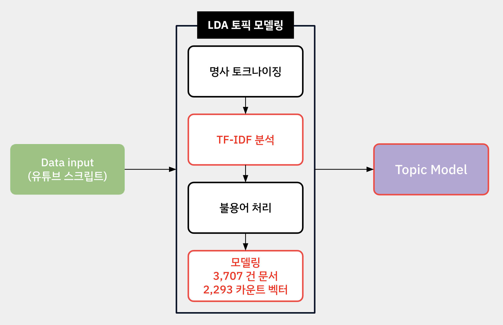
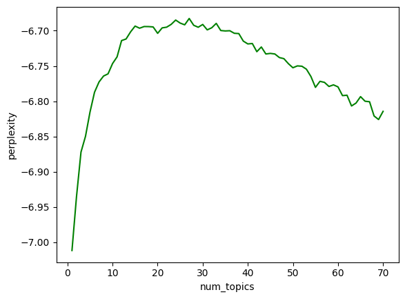
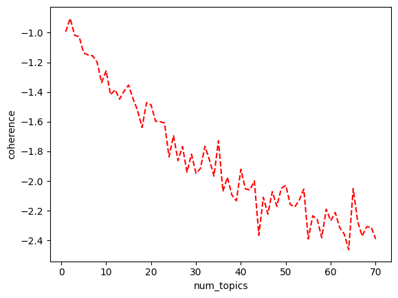

# 1. Data
- 유튜브 뉴스 스크립트 데이터: 3,707건
- 영상 1 - txt파일 1

<br>

# 2. LDA Topic modeling Flow


<br>

# 3. Source
### 1. CustomTokenize.py
- Raw 스크립트를 명사만 남겨주는 토크나이저
- 명사로 이루어진 토픽 추출을 위한 과정

### 2. preprocess.py
- 스크립트 txt 파일들을 불러와 전처리

### 3. stopwords.py
- TF-IDF 분석 기반으로 불용어 사전 구축하여 불용어 처리

### 4. lda_modeling.py
- 명사로만 이루어진 스크립트와 불용어 사전, 카운터 벡터를 전달받아 LDA 토픽 모델링 진행

### 5. main.py
- 전처리부터 LDA 토픽 모델링, 저장까지 관리

<br>

# 4. 실행방법
```bash
pip install -r requirements.txt
python main.py
```
- 스크립트가 txt파일로 모인 폴더 경로 설정 필요

<br>

# 5. Result
| Perplexity | Coherence |
|-------------------|--------------|
|  |  |