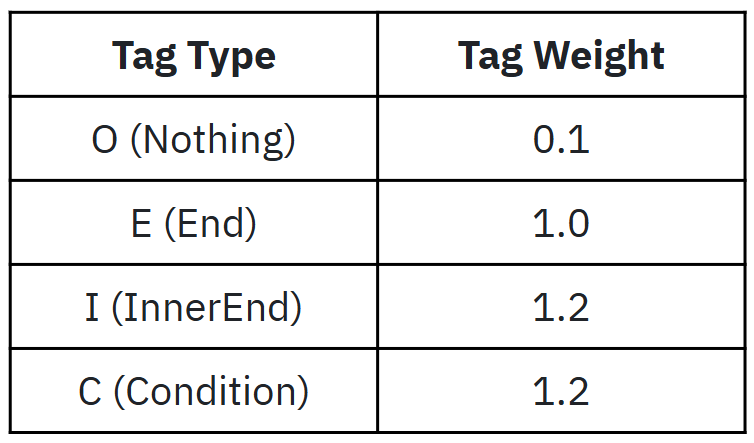
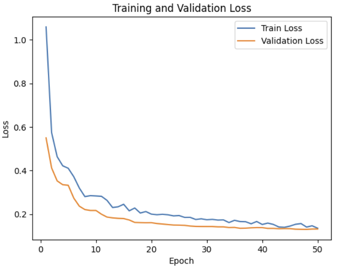

# Clause-Level Semantic Similarity Pipeline

이 프로젝트는 문장 또는 절(clause) 단위 임베딩을 기반으로, 대규모 텍스트 사이의 의미 유사성을 효율적으로 탐색하는 전체 파이프라인을 제공합니다.  
PyTorch 기반으로 학습과 추론을 수행하며, ScaNN/Faiss 기반의 빠른 검색 및 정확한 cosine 비교까지 지원합니다.

---

## 📌 주요 구성 파일

### 1. `train.py` — 문장 분류기 학습
- 사용 모델:  `KF-DeBERTa` + `TaggingModel`
- 목적: 문장을 절 단위로 분할하기 위한 시퀀스 태깅 모델 학습
- 특징:
  - Custom token classifier : [ O, End, Inner end, Condition ] (weighted)
  - Custom loss (e.g., weighted CrossEntropy)
  - Accelerate / Trainer 지원
<p align="center">
     
</p>
### 2. `prediction.py` — 절 단위   관계 추출
- 입력: 비정제 youtubesript (raw text)
- 출력: 각 토큰의 O/E/I/C 태그 예측 및 절 구문 분리

####  기능 요약
- DeBERTa 기반 토큰 분류 모델을 활용하여 절의 경계(E/E2/E3)를 예측  
- `confidence_threshold`에 따라 불확실한 경계 보정 가능 (절 분리 민감도 조절)  
- batch 단위로 문장을 처리하며 `tqdm`으로 진행 상황 출력  
- WordPiece 기반 토크나이징 후 원문 복원 및 절 단위 구성까지 자동 처리  
- 절 간 의미적 관계 추출(triplet 구성)을 위한 단서 기반 후처리 로직 포함 가능  

####  활용 목적
- `ClauseSpliting` 파이프라인 내 핵심 모듈로 작동  
- Knowledge Graph 구축을 위한 구조화된 절 및 관계 정보의 전처리를 담당  
<p align="center">


</p>
<p align="center">
 
</p>

### 3. `decide_same.py` — 의미 유사 구문 후보 탐색
- 입력: 절 단위 임베딩 벡터 (SBERT, DeBERTa 기반)
- 처리 흐름:
  1. `Linear(768→64)` 투사 후 cosine 유사도 상위 N개 fast filtering
  2. 정밀 비교 위해 원래 768 임베딩 기반 cosine 유사도 재계산
  3. threshold 기반 filtering and euclidian distance도 고려하여 관계분류
- 특징:
  - `torch.matmul`을 batch로 나눠 메모리 최적화
  - Fast filtering은 상삼각만 계산하여 중복 제거

### 4. `test.py` — 전체 파이프라인 검증
- 구성:
  - 모델 불러오기
  - prediction → embedding → similarity → filtering 까지 연결
- 결과:
  - 의미 유사한 절쌍 출력
  - 최종 결과는 `(id1, id2, similarity)` 형태로 `.npy` 저장

---

## ⚙️ 주요 기술 스택

| Task               | Tool/Library                |
|--------------------|-----------------------------|
| Transformer 모델   | HuggingFace Transformers    |
| 임베딩            | KoBERT / KF-DeBERTa         |
| 토큰화            | `AutoTokenizer`, `Kiwi`     |
| 유사도 계산       | PyTorch `cosine_similarity` |
| 빠른 탐색         | FAISS / ScaNN (선택 가능)  |
| 시각화/진행상황    | `tqdm`, `matplotlib`         |

---

## 💾 데이터 저장 방식

- 절 벡터: `embedding_batch_*.npy`
- 유사 절쌍: `similar_temp.npy` (최종 결과)
- prediction 결과: `.jsonl` or `.json`

---

## 📈 향후 개선점

- GPU 분산 inference
- 의미 강조 단어 자동 하이라이트
- 문장 간 논리적 관계 추출 (인과 / 대조 등)
- MILVUS 연동 or RAG 엔진 구성

---

## 📂 예시 실행 흐름

```bash
# 1. 모델 학습
python train.py --config configs/kf_deberta.yaml

# 2. 절 분할 예측
python prediction.py --input input_text.txt --output predicted_clauses.jsonl

# 3. 유사 절쌍 탐색
python decide_same.py --input predicted_clauses.jsonl --output similar_temp.npy

# 4. 결과 검증
python test.py --input similar_temp.npy
```
---
## 🧑‍💻 사용 안내 (Usage Guide)

### 🔹 1. `train.py` — 절 구분 모델 학습

```bash
python train.py --config configs/kf_deberta.yaml
```

- **입력**: YAML 설정 파일 (`configs/*.yaml`)  
- **출력**: 모델 체크포인트, 로그 파일, 성능 시각화  
- **기능**: KF-DeBERTa 또는 KoBERT 기반 절 구분 BIO / E / E2 / E3 태그 예측 모델 학습

---

### 🔹 2. `prediction.py` — 문장을 절 단위로 분리

```bash
python prediction.py --input input_text.txt --output predicted_clauses.jsonl
```

- **입력 예시 (`input_text.txt`)**:

  ```
  경제성장을 촉진하기 위해 금리를 인하했다.
  인플레이션이 우려되자 다시 금리를 인상했다.
  ```

- **출력 예시 (`predicted_clauses.jsonl`)**:

  ```json
  {"clause": ["경제성장을 촉진하기 위해", "금리를 인하했다"]}
  {"clause": ["인플레이션이 우려되자", "다시 금리를 인상했다"]}
  ```

- **기능**: 문장을 형태소 기반 토크나이징 → 태깅 모델 → 절 단위 분리

---

### 🔹 3. `decide_same.py` — 유사 절쌍 탐색 및 정밀 유사도 계산

```bash
python decide_same.py --input predicted_clauses.jsonl --output similar_temp.npy
```

- **처리 과정**:
  - `Linear(768→256→64)` 투영 → cosine 기반 Top-K 후보 탐색
  - 원본 `768` 차원으로 다시 정확한 유사도 계산

- **출력** (`similar_temp.npy`):

  ```python
  [
    (clause_id1, clause_id2, similarity_score),
    ...
  ]
  ```

- **기능**: 의미적으로 유사한 절 쌍 추출

---

### 🔹 4. `test.py` — 전체 파이프라인 테스트

```bash
python test.py --input input_text.txt
```

- **기능**:
  - 문장 입력 → 절 분리 → 유사 절 후보 도출 → cosine 유사도 계산
  - 전체 파이프라인을 한 번에 확인 가능

---

## 📦 요구사항 (Requirements)

```bash
pip install -r requirements.txt
```

- PyTorch
- transformers
- tqdm
- numpy
- scikit-learn
- kiwipiepy
- accelerate (선택)

---

## 📌 참고

- 절 단위 분리 태그: `O`, `E`, `E2`, `E3`
- `768 → 64` 차원 축소는 `nn.Linear` 기반
- similarity threshold 또는 Top-K 기반으로 후보 필터링

---