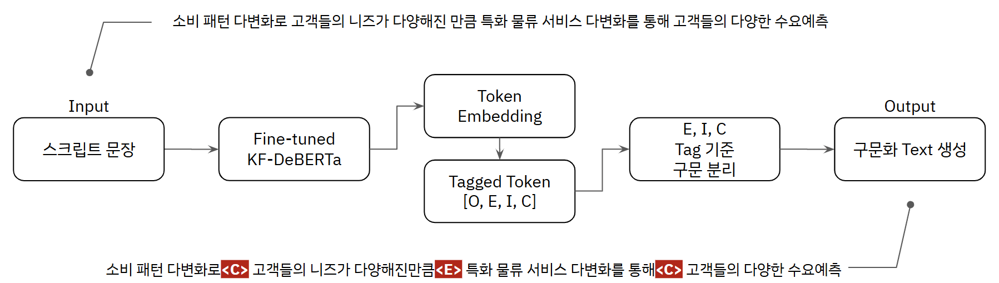
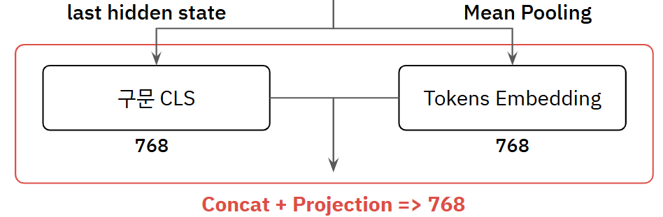

# Clause-Level Semantic Similarity Pipeline

## 프로젝트 개요
**문장 또는 절(clause) 단위 임베딩**을 기반으로, **대규모 텍스트** 사이의 **의미 유사성**을 효율적으로 탐색하고, 구조화된 텍스트 관계를 추출하는 전체 파이프라인입니다.  

- **PyTorch 기반 학습 및 추론**
- **ScaNN / FAISS 기반 빠른 유사도 검색**
- **절 경계 예측, 임베딩 생성, 유사 절쌍 탐색, 전처리까지 포함한 엔드투엔드 시스템**


## 프로젝트 플로우
```

[Raw Text]
↓
[prediction.py] 문장을 절 단위로 분할 (KF-DeBERTa tagging)
↓
[embedding] 절 단위 벡터 임베딩 생성
↓
[decide_same.py] 의미 유사 절쌍 탐색 (cosine similarity)
↓
[test.py] 결과 출력 및 유사 절쌍 시각화 / 저장
```
<br>

<p align="center">


</p>
<p align="center">
 
</p>

## 실행 방법
1. 환경 설정
```
PyTorch
transformers
tqdm
numpy
scikit-learn
kiwipiepy
accelerate (선택)
```
2. 의존성 설치
```
pip install -r requirements.txt
```
3. 절 분할 모델 학습
```
python train.py --config configs/kf_deberta.yaml
```
4. 절 단위 예측
```
python prediction.py --input input_text.txt --output predicted_clauses.jsonl
```
5. 유사 절쌍 탐색
```
python decide_same.py --input predicted_clauses.jsonl --output similar_temp.npy
```
6. 결과 검증
```
python test.py --input similar_temp.npy
```

## 프로젝트 구조

```
clause_split/
├── image/                 # 이미지
├── train.py               # 문장 분류기 학습
├── prediction.py          # 문장을 절 단위로 분리
├── decide_same.py         # 유사 절쌍 탐색 및 정밀 유사도 계산
├── test.py                # 전체 파이프라인 검증
└── requirements.txt       # 환경 설정
```
